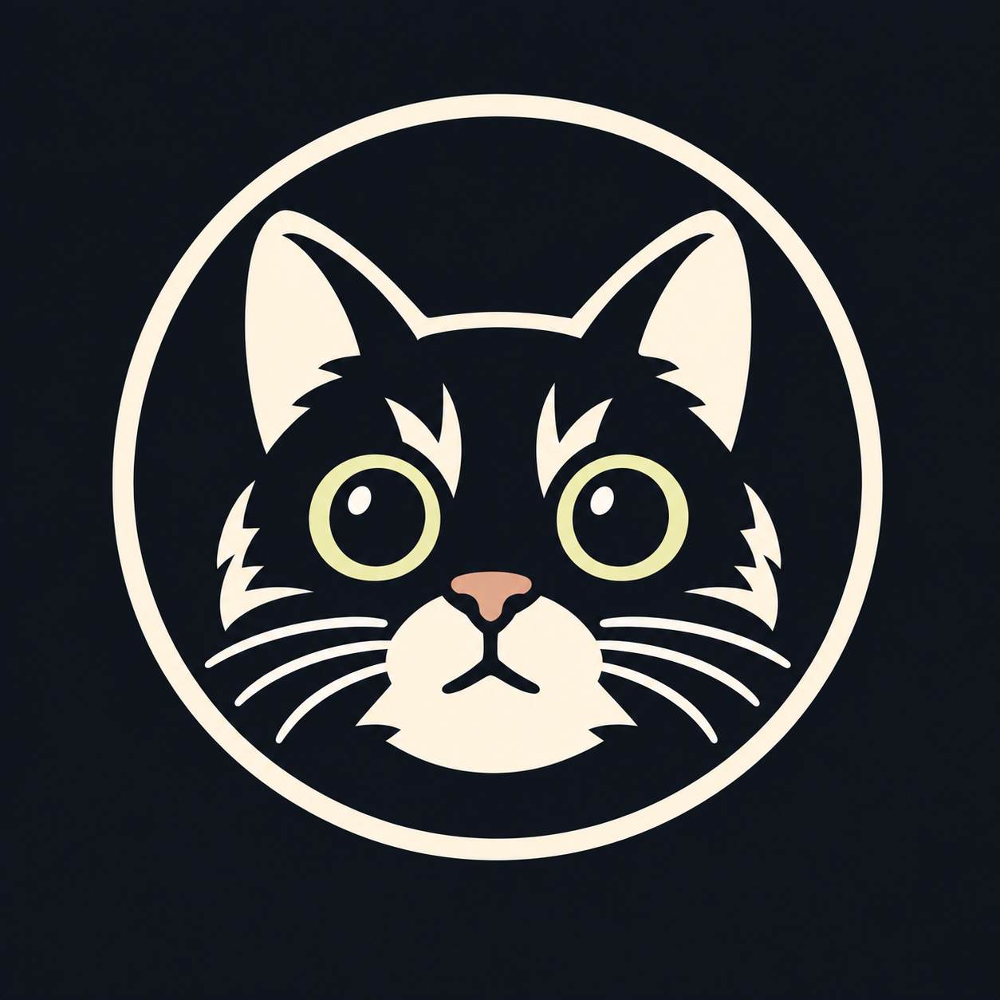

# Gizmo



A C++ command-line wrapper around llama.cpp for running quantized LLMs locally, with a focus on **honest memory reporting** and a per-block sharded inference engine (prefill + decode).

## Quick Start

```bash
# Install the latest release binary (requires ~/.local/bin on PATH)
curl -fsSL https://raw.githubusercontent.com/maseus/gizmo/master/install.sh | bash

# Or build from source (uses CMake; produces a static binary)
cmake -S . -B build -DCMAKE_BUILD_TYPE Release
cmake --build build -j$(nproc)

# Install to ~/.local/bin so `gizmo` is on PATH
cmake --install build --prefix ~/.local

# Use it from anywhere
gizmo --help                   # show help
gizmo info
gizmo chat                     # interactive chat with model picker
gizmo run -m /path/to/model.gguf -p "Hello"
gizmo run -m /path/to/model.gguf -p "Hello" -r 1 -n 4 --measure-ram
gizmo run -m /path/to/model.gguf -p "Hello" --progress -n 4
gizmo chat                     # interactive chat with model picker
gizmo chat -m /path/to/model.gguf -n 64

# Start the OpenAI-compatible HTTP server directly (requires -m)
gizmo serve -m /path/to/model.gguf --cors --port 8080
# Use --json-logs and --log-file for structured request logs
gizmo serve -m /path/to/model.gguf --cors --json-logs --log-file /var/log/gizmo.log

# Launch the interactive server dashboard instead
gizmo tui

# Add custom model directories (also set GIZMO_MODEL_PATH=~/models:/data/ggufs)
gizmo chat --model-path ~/models:/data/ggufs
```

## What Gizmo does

- Wraps llama.cpp's library API with a small CLI (`run`, `chat`, `bench`, `validate`, `sweep`, `list`, `download`, `info`, `serve`/`server`, `tui`).
- Reports **real** memory usage (`/proc/self/status:VmRSS` / `VmHWM`) at model load, during generation, and at end-of-run. Use `--measure-ram` to print periodic VmRSS samples to stderr while generation is running.
- Builds the llama.cpp dependency as a static library so the `gizmo` binary is self-contained.
- Implements a **per-block sharded inference engine** for **qwen3-family** and **qwen3.5-family** models. This engine builds a separate `ggml_cgraph` per transformer block, threads the residual/KV/recurrent state, and can evict each block's weights after use. Output matches the native `llama_decode` baseline exactly for both prefill and decode on supported architectures.
- Automatically falls back to native `llama_decode` for unsupported architectures (e.g., qwen2/qwen2.5, qwen3next/qwen3vl, and all MoE variants), so those models still work correctly with `--no-shard`-equivalent behavior.
- Uses the model's built-in chat template in `gizmo chat` and in the `/v1/chat/completions` endpoint via `llama_chat_apply_template` when available.
- Runs an **OpenAI-compatible HTTP server** with graceful shutdown (SIGINT/SIGTERM), per-request timeouts, a bounded generation queue (safe for single-user + Claude Code subagents), structured JSON request logs, and CORS for browser frontends.
- Serves on all interfaces by default and prints LAN IP addresses in the interactive `tui` dashboard.

## What Gizmo does **not** do (yet)

- Built-in model downloader (current `download` delegates to the system `curl`/`wget` binary).

## Commands

| Command     | Description |
|-------------|-------------|
| `run`       | Run a model with a single prompt |
| `chat`      | Interactive multi-turn chat with streaming output and tok/s stats. With no `-m`, a TUI picker chooses from discovered models |
| `bench`     | Memory/performance benchmark across prompt lengths |
| `validate`  | Compare sharded vs un-sharded logits on a built-in prompt suite |
| `sweep`     | Run a full generate() sweep over `-t`, `-r` and `-K` configs |
| `list`      | Scan common model directories for `.gguf` files and print metadata |
| `download`  | Download a model from URL using the system's `curl` or `wget` |
| `info`      | Show system memory info |
| `serve`     | Start HTTP server (OpenAI-compatible API); requires `-m`. `server` is an alias |
| `tui`       | Launch interactive server TUI (model picker + live dashboard) |

When no command is given, `gizmo` prints this help. Use `gizmo chat` for the interactive chat TUI, `gizmo serve -m <model>` for the non-interactive OpenAI-compatible HTTP server, and `gizmo tui` for the interactive server dashboard.

## Options

- `-m, --model <path>` — path to a GGUF file
- `-l, --layers <N>` — alias for `--resident-layers`
- `-r, --resident-layers <N|list>` — number of blocks to keep resident. Single value for normal commands (default 8); comma-separated list for `sweep` (default `1,4,8,16`)
- `-K, --row-size <K|list>` — chain K blocks per `ggml_cgraph`. Single value for normal commands (default 1); comma-separated list for `sweep` (default `1,2,4`)
- `-t, --threads <N|list>` — CPU threads for `llama_decode` and the sharded backend. Single value for normal commands (default 4); comma-separated list for `sweep` (default `4`)
- `-n, --max-tokens <N>` — maximum tokens to generate for `run`/`chat` (default: 128)
- `--no-shard` — disable the sharded engine and use plain `llama_decode`; the full model is prefaulted at load time
- `--no-evict` — skip `madvise(MADV_DONTNEED)` after each block; keeps weights resident for faster generation at higher RSS
- `--measure-ram` — print VmRSS to stderr every `--measure-interval-ms` ms during `run`/`chat`/`server`
- `--measure-interval-ms N` — sample interval (default 500)
- `-v, --verbose` — print sharded-engine diagnostic details (per-block progress, argmax reports)
- `--progress` — show an in-place block/token progress indicator during sharded prefill/decode (TTY only; automatically silenced when `--verbose` is set or stdout is not a terminal)
- `-p, --prompt <text>` — prompt for `run`
- `--json` — emit validation/sweep results as JSON
- `--argmax-only` — validate only argmax parity, ignore logit diffs (for `validate`)
- `--max-diff <f>` — max abs logit diff tolerance (default: 1e-4, for `validate`)
- `--mean-diff <f>` — mean abs logit diff tolerance (default: 1e-5, for `validate`)
- `--sweep-max-tokens N` — `sweep`: decode tokens per configuration (default 16)
- `--sweep-prefill-tokens N` — `sweep`: prefill tokens per configuration (default 64)
- `--host <addr>` — server bind address (default: `0.0.0.0`)
- `--port <N>` — server port (default: 8080)
- `--server-threads <N>` — HTTP worker threads (default: 4)
- `--cors` — enable CORS headers (required for browser frontends such as OpenWebUI and Hermes Desktop)
- `--request-timeout <N>` — per-request generation timeout in seconds (default: 300)
- `--log-file <path>` — append structured JSON request logs to a file
- `--json-logs` — also emit structured JSON request logs to stderr
- `-h, --help` — help
- `--model-path <path[:path]>` — extra directories to scan for GGUF models. Also read from `GIZMO_MODEL_PATH` environment variable

## Measured RAM

### qwen3.8:27b Q4_K_M (`-r 1 -n 4`) — sharded

The qwen3.8:27B model is a **qwen35-family** model and uses the per-block sharded engine by default.
With only one block resident at a time, peak resident memory stays comfortably under 2 GB.

```
$ gizmo run -m Qwen3.8-27B-Q4_K_M.gguf \
    -p "What is the capital of France?" -r 1 -n 4 --measure-ram
...
VmRSS after model load: ~293 MB
[measure] VmRSS=~1900 MB  VmHWM=~2050 MB
...
VmHWM (peak resident):  ~2050 MB
The capital of
```

For comparison, loading the full 27B model into RAM (`--no-shard`) requires roughly 16–17 GB resident.

### qwen3-family example: Qwen3-4B (`-r 1 -n 4`)

```
$ gizmo run -m Qwen3-4B-Instruct-2507-Q4_K_M.gguf \
    -p "What is the capital of France?" -r 1 -n 4 --measure-ram
...
VmRSS after model load: ~120 MB  (delta: ~+115 MB)
[measure] VmRSS=~510 MB  VmHWM=~630 MB   # during sharded prefill
[measure] VmRSS=~500 MB  VmHWM=~630 MB   # during decode
...
VmRSS after generation: ~500 MB
VmHWM (peak resident):  ~630 MB
```

Add `--verbose` to see the sharded-engine per-block progress and per-token argmax reports.

### Validation

```
$ gizmo validate -m Qwen3-4B-Instruct-2507-Q4_K_M.gguf -r 1
Gizmo Validate: Qwen3-4B-Instruct-2507-Q4_K_M.gguf
  resident_layers=1 row_size=1

prompt                                 | tokens | argmax_match | max_abs_diff | mean_abs_diff | status
---------------------------------------+--------+--------------+--------------+---------------+-------
Hi                                     |      1 |          yes |     0.00e+00 |      0.00e+00 | PASS
Hello world                            |      2 |          yes |     0.00e+00 |      0.00e+00 | PASS
What is the capital of France?         |      7 |          yes |     0.00e+00 |      0.00e+00 | PASS
The capital of France is Paris. The... |     35 |          yes |     0.00e+00 |      0.00e+00 | PASS

All cases passed.
```

The `validate` command loads the model twice: once with `--no-shard` as the
baseline, and once with sharding enabled, then compares last-token logits for a
built-in prompt suite. Default tolerances are `max_abs_diff < 1e-4` and
`mean_abs_diff < 1e-5`; use `--argmax-only` to ignore logit values and only
check that the top token matches.

### Chat

```
$ gizmo chat -m Qwen3-4B-Instruct-2507-Q4_K_M.gguf -n 64

Gizmo Chat: Qwen3-4B-Instruct-2507-Q4_K_M.gguf
Type a message and press Enter. Commands: /quit, /reset, /clear
---------------------------------------------------------------

You: Hello
Assistant: Hi there! How can I help you today?
  [8 tokens in 108.04 s => 0.1 tok/s; RSS 3091 MB; HWM 5186 MB]

You: /quit
Chat ended.
```

`gizmo chat` is a simple interactive chat loop. It streams the assistant response as tokens arrive and prints throughput and memory after each turn. The context accumulates across turns; use `/reset` to clear it. When the model exposes a chat template, the conversation is formatted with `llama_chat_apply_template`; otherwise it falls back to a plain-text format.

### Performance sweep

```
$ gizmo sweep -m Qwen3-4B-Instruct-2507-Q4_K_M.gguf

Gizmo Sweep: Qwen3-4B-Instruct-2507-Q4_K_M.gguf
  prefill tokens=64  decode tokens=16  no_evict=false

 config  |  t |  r |  K | wall (s) |  tok/s | VmRSS (MB) | VmHWM (MB) | prefill RSS (MB) | prefill HWM (MB)
---------+----+----+----+----------+--------+------------+------------+------------------+------------------
 unshard |  4 |  - |  - |    45.21 |   1.77 |       9234 |       9456 |                - |                -
 shard   |  4 |  1 |  1 |   128.34 |   0.62 |       1456 |       2134 |             1380 |             2023
 shard   |  4 |  1 |  2 |   104.12 |   0.77 |       1623 |       2456 |             1550 |             2345
 shard   |  4 |  1 |  4 |    76.55 |   1.05 |       1890 |       2678 |             1800 |             2567
 ...
```

The `sweep` command runs a full `generate()` for each `(threads, resident_layers, row_size)` configuration and reports wall time, throughput, and peak RSS/HWM. It begins with an un-sharded baseline per thread count so you can compare the speed/memory trade-off directly. Use `--json` for machine-readable output or override the default matrix with `-t 2,4,8 -r 1,4,8,16 -K 1,2,4`.

## Model support notes

The sharded engine is implemented and validated for **qwen3-family full-attention** and **qwen3.5-family hybrid** (full-attention + gated-delta-net recurrent) models, including **Qwen3.8-27B**. Unsupported architectures, including **qwen2 / qwen2.5**, **qwen3next / qwen3vl**, and MoE variants (`qwen3moe`, `qwen35moe`, `qwen3vlmoe`), are detected at load time and the sharded engine is disabled automatically, falling back to native `llama_decode` so you still get correct output. Use `--no-shard` explicitly if you want to force the un-sharded path.

> **Memory tip for Qwen3.8-27B on 16 GB hosts:** use `-r 1` to keep only one block resident at a time. A default `-r 8` run can exceed 12 GB resident and may make the host unresponsive.

## HTTP Server

`gizmo serve -m model.gguf` (alias `gizmo server -m model.gguf`) starts a non-interactive OpenAI-compatible HTTP server on `--host` / `--port` (default `0.0.0.0:8080`). `gizmo tui` opens the interactive server dashboard instead.

| Method | Endpoint | Description |
|--------|----------|-------------|
| `GET`  | `/health`     | Health check |
| `GET`  | `/v1/health`  | Health check under `/v1/` |
| `GET`  | `/v1/`        | Models list (OpenAI-compatible root) |
| `GET`  | `/v1/models`  | List loaded model |
| `POST` | `/v1/completions` | Legacy text completion |
| `POST` | `/v1/chat/completions` | Chat completion (streaming SSE supported) |

Enable CORS with `--cors`.

### Production serving

- **Single-user, LAN-safe**: binds to `0.0.0.0` by default, so it is discoverable on your local network. There is no authentication or HTTPS yet; only run it on networks you trust.
- **Graceful shutdown**: `SIGINT`/`SIGTERM` stop new requests and let the current generation finish.
- **Request timeout**: each generation is capped by `--request-timeout` (default 300 s). Slow/hung requests are cancelled cleanly.
- **Concurrency**: the engine runs one generation at a time; extra requests queue up to `max_queue_depth` (8) and are rejected with HTTP 503 once the queue is full. This is safe for Claude Code subagents that may issue parallel requests.
- **Structured logs**: use `--json-logs` for one JSON line per request on stderr, and `--log-file` to append to a file for dashboards or log shippers.
- **Client compatibility**: tested with **OpenWebUI**, **Hermes Desktop**, and **Claude Code**. Point them at `http://<host>:<port>/v1/chat/completions`.

```bash
# Serve a model with CORS and 60-second request timeout
gizmo serve -m /path/to/model.gguf --host 0.0.0.0 --port 8080 --cors --request-timeout 60

# Emit JSON request logs to stderr and a file
gizmo serve -m /path/to/model.gguf --json-logs --log-file /var/log/gizmo.log

# Test the endpoints
curl http://127.0.0.1:8080/v1/health
curl http://127.0.0.1:8080/v1/models
curl -X POST http://127.0.0.1:8080/v1/chat/completions \
  -H "Content-Type: application/json" \
  -d '{"messages":[{"role":"user","content":"Hello"}],"max_tokens":16}'
```

### Docker

A multi-stage `Dockerfile` is included. Build it and run a model mounted from the host:

```bash
docker build -t gizmo .
docker run -p 8080:8080 -v /path/to/models:/models:ro gizmo \
  serve -m /models/model.gguf --cors --host 0.0.0.0
```

## Packaging and releases

- **Install script**: `install.sh` downloads the latest GitHub Release binary for Linux/macOS and places it in `~/.local/bin` (or `$INSTALL_DIR`).
- **GitHub Actions**: `.github/workflows/build.yml` builds on `ubuntu-latest` and `macos-latest` and uploads release artifacts for every `v*` tag.
- **CPack**: `cmake --build build --target package` produces `.tar.gz` archives and, on Debian/Ubuntu, `.deb` packages.

## Project Structure

```
gizmo-dev/
├── include/
│   ├── chat_tui.hpp
│   ├── cli_parser.hpp
│   ├── inference_engine.hpp
│   ├── layer_manager.hpp
│   ├── model_discovery.hpp
│   ├── model_manager.hpp
│   ├── proc_status.hpp
│   ├── server/server.hpp
│   └── tui.hpp
├── src/
│   ├── main.cpp
│   ├── cli/parser.cpp
│   ├── layer/manager.cpp
│   ├── model/manager.cpp
│   ├── inference/engine.cpp
│   ├── server/server.cpp
│   ├── ui/chat_tui.cpp
│   ├── ui/model_discovery.cpp
│   ├── ui/tui.cpp
│   └── util/proc_status.cpp
├── tools/sharded_engine/       # Per-block prefill/decode engine
│   ├── main.cpp
│   ├── multi_block.cpp
│   ├── shard_block.cpp
│   └── tail_graph.cpp
├── llama.cpp/                  # Submodule (built static)
├── build/gizmo                 # Static binary
├── CMakeLists.txt              # Build system
└── README.md
```

## Build System

- `cmake -S . -B build -DCMAKE_BUILD_TYPE=Release` — configure
- `cmake --build build -j$(nproc)` — build
- `cmake --install build --prefix ~/.local` — install to `~/.local/bin`
- The `Makefile` is kept for backwards compatibility but does **not** link llama.cpp. Use CMake.

## License

MIT

## Contributing

Real areas where help are welcome:

- Resident-layer, row-size, and thread-count sweeps to find the RSS/speed sweet spot per model family.
- Built-in model downloader via libcurl.
- Built-in `download` command via libcurl.
- Chat-template-aware formatting in the HTTP server's `/v1/chat/completions`.
